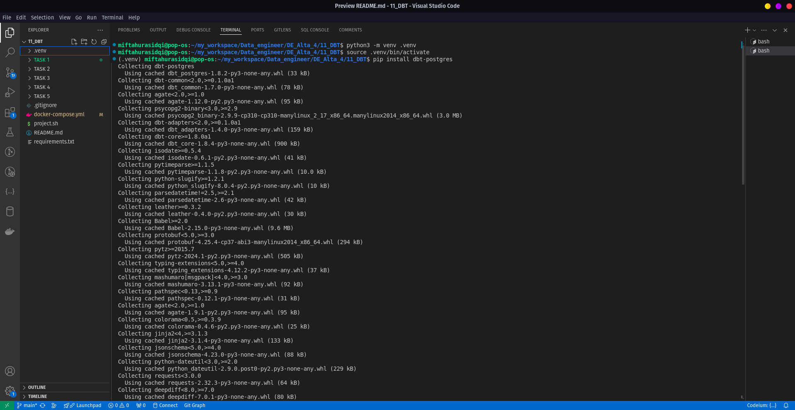
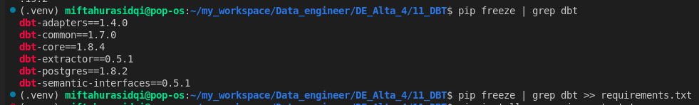
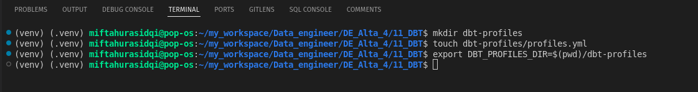
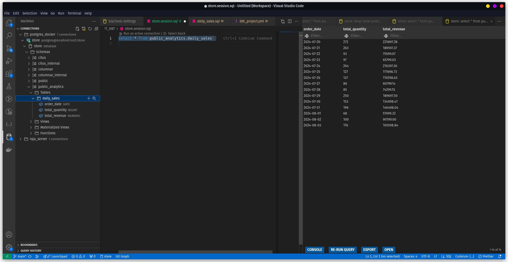

# Solusi Task 3

# 1. Setup venv and install DBT

menjalankan perintah di terminal



# 2. Create requirements.txt



# 3. Setup DBT project


Make sure to choose the correct database (in this case postgres)

# 4. Setup DBT Profile



setelah file `profiles.yml` terbuat di folder `dbt-profiles` lalu di isi dengan pengaturan berikut:

```yml
my_project:
  outputs:
    dev:
      dbname: store
      host: localhost
      pass: pass
      port: 5432
      schema: public
      threads: 1
      type: postgres
      user: postgres
  target: dev
```

# 5. Setup DBT Project configuration

Edit file `my_project/dbt_project.yml`.

hapus models `example` dan tambah kan model `store` dan `store_analytics`

```yml
models:
  my_project:
    store:
      +schema: public
      +database: store
    store_analytics:
      +materialized: table
      +schema: analytics
      +database: store
```

setelah itu masuk ke folder `models` dan buat 2 buah direktori:

- `store`
- `store_analytics`
  hapus juga direktori `example` karena tidak digunakan

# 6. Defining Source

untuk mendefinisikan sumber tabel, perlu membuat file `models/store/raw_schema.yml`

```yml
version: 2

sources:
  - name: store
    database: store
    schema: public

    tables:
      - name: brands
        columns:
          - name: brand_id
            description: "Unique identifier for each brand"
            tests:
              - unique
              - not_null
          - name: name
            description: "Name of the brand"
            tests:
              - not_null

      - name: products
        columns:
          - name: product_id
            description: "Unique identifier for each product"
            tests:
              - unique
              - not_null
          - name: brand_id
            description: "Foreign key referencing brands"
            tests:
              - relationships:
                  to: source('store', 'brands')
                  field: brand_id
          - name: name
            description: "Name of the product"
            tests:
              - not_null
          - name: price
            description: "Price of the product"
            tests:
              - not_null

      - name: orders
        columns:
          - name: order_id
            description: "Unique identifier for each order"
            tests:
              - unique
              - not_null
          - name: order_date
            description: "Date and time the order was placed"
            tests:
              - not_null

      - name: order_details
        columns:
          - name: order_detail_id
            description: "Unique identifier for each order detail"
            tests:
              - unique
              - not_null
          - name: order_id
            description: "Foreign key referencing orders"
            tests:
              - relationships:
                  to: source('store', 'orders')
                  field: order_id
          - name: product_id
            description: "Foreign key referencing products"
            tests:
              - relationships:
                  to: source('store', 'products')
                  field: product_id
          - name: quantity
            description: "Quantity of the product ordered"
            tests:
              - not_null
          - name: price
            description: "Price of the product in the order"
            tests:
              - not_null
```

# 7. Creating a Model

untuk membuat model perlu membuat file `models/store_analytics/store_schema.yml`.

```yml
version: 2

models:
  - name: daily_sales
    description: "Aggregated sales metrics per day"
    columns:
      - name: order_date
        description: "The date of the orders"
        tests:
          - not_null
      - name: total_quantity
        description: "Total quantity of products sold"
        tests:
          - not_null
      - name: total_revenue
        description: "Total revenue for the day"
        tests:
          - not_null
```

setelah itu buat file dengan nama `daily_sales` menyesuaikan dengan apa yg di definisikan di `models/store_analytics/store_schema.yml`.
file tersebut dibuat dengan ext `.sql`di dalam folder yg sama `models/store_analytics/daily_sales.sql`

```sql
WITH base AS (
    SELECT
        DATE(orders.order_date) AS order_date,
        order_details.quantity,
        order_details.price
    FROM
        {{ source('store', 'orders') }} AS orders
    JOIN
        {{ source('store', 'order_details') }} AS order_details
    ON
        orders.order_id = order_details.order_id
),

aggregated_sales AS (
    SELECT
        order_date,
        SUM(quantity) AS total_quantity,
        SUM(price) AS total_revenue
    FROM
        base
    GROUP BY
        order_date
)

SELECT
    *
FROM
    aggregated_sales
ORDER BY
    order_date
```

# Run and test your model

pastikan terminal berada di direktori `my_project` dan jalankan `dbt run && test`


# Check the result

```sql
select *
from public_analytics.daily_sales
```


