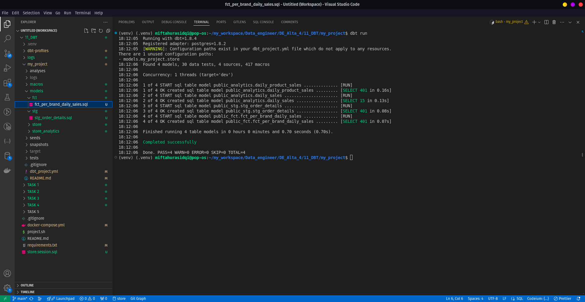
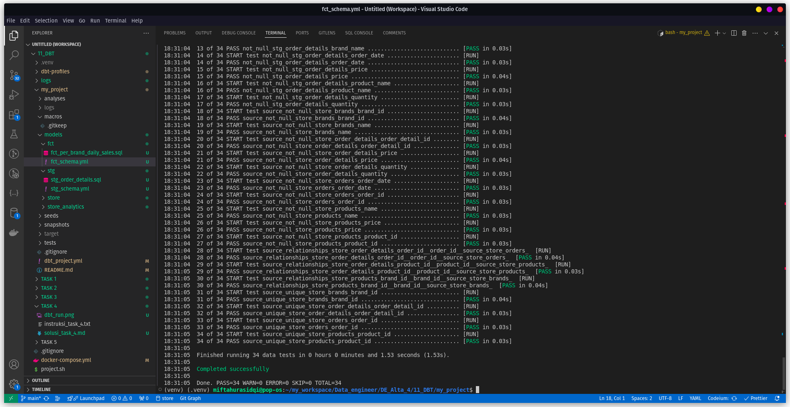

# Solusi Task 4

# 1. Make a model named on `stg_order_details`

    - order_date
    - quantity
    - price
    - brand name
    - product name

create `stg_order_details.sql`
full code on [stg_order_details.sql](../my_project/models/stg/stg_order_details.sql)

# 2. Base on `stg_order_details`, make another model named `fct_per_brand_daily_sales`

    - brand_name
    - order_date
    - total_quantity
    - total_revenue

create `fct_per_brand_daily_sales.sql`
full code on [fct_per_brand_daily_sales.sql](../my_project/models/fct/fct_per_brand_daily_sales.sql)

# Setup DBT Profile

setelah membuat `stg_order_details` dan `fct_per_brand_daily_sales` perlu memperarui `dbt-profile.yml`
[dbt-profile..yml](../my_project/dbt_project.yml)

# Run models

menjalankan model yg telah dibuat `dbt run`

# 3. Add test to make sure that `fct_per_brand_daily_sales` has `unique combination` of `order_date` and `brand_name`

create `stg_schema.yml`
difine schema on [stg_schema.yml](../my_project/models/stg/stg_schema.yml)

create `fct_schema.yml`
difine schema on [fct_schema.yml](../my_project/models/fct/fct_schema.yml)

# Run test

menjalankan test `dbt test`

