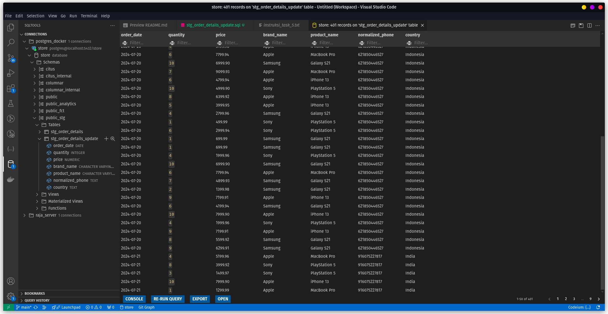
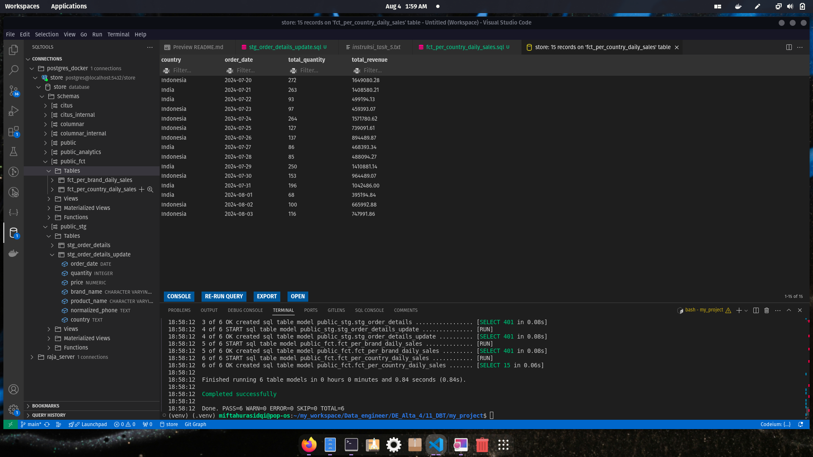

# Solusi Task 5

# 1. normalized_customer_phone

    - customer_phone
    - normalized_customer_phone (use macro to normalize the phone number)
    - country (based on normalized_customer_phone)
        - If the phone number is started with 62, the country should be Indonesia
        - If the phone number is started with 91, the country should be India

create `stg_order_details_update.sql`
full code on [stg_order_details_update.sql](../my_project/models/stg/stg_order_details_update.sql)

result

# 2. fct_per_country_daily_sales

    - country
    - order_date
    - total_quantity
    - total_revenue

create `fct_per_country_daily_sales.sql`
full code on [fct_per_country_daily_sales.sql](../my_project/models/fct/fct_per_country_daily_sales.sql)

result

